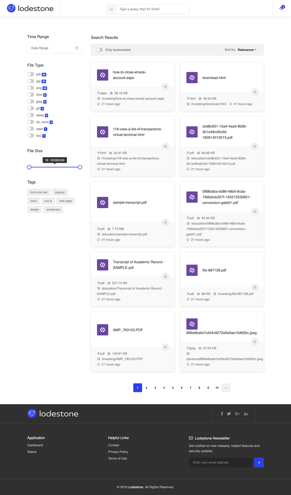

<p align="center">
  <a href="https://github.com/LodestoneHQ/lodestone">
  
  </a>
</p>


# Lodestone - Personal Document Search & Archive

[](https://github.com/LodestoneHQ/lodestone/blob/master/LICENSE)
[](https://hub.docker.com/r/analogj/lodestone)
[](https://gitter.im/lodestone-chat/devs)

> NOTE: Lodestone is a Work-in-Progress and is not production ready.

Lodestone is designed to be the modern and digital equivalent of a home filing cabinet.
If you've gone searching for something similar in the past, you might be familiar with terms like Electronic Document
Management System (EDMS), Document Management System (DMS) or Personal Archival.

Lodestone is designed around a handful of core features:

- **Full text document search** - It doesn't matter what format you're document is in, we should be able to parse it (using OCR) and let you search for the text.
- **Rich tagging** - Unlike a physical file cabinet where a document can only exist in one place, digital documents support tags, allowing you to create a flexible organizational structure that works for you.
- **Automated** - Document collection & OCR processing should be automatic. Just saving a file to your network drive should be enough to start document processing.
- **Non-destructive** - When Lodestone processes a document, the original file will be left untouched, exactly where you left it.
- **Web Accessible** - Lodestone is designed to run on a trusted home server and be accessible 24x7.
- **Filesystem/Cloud Sync** - Optionally synchronize your tagged documents via a cloud storage provider of your choice (Dropbox, GDrive, etc) or access via a FUSE filesystem mount.

# Screenshot



More screenshots available in the [docs/screenshots](docs/screenshots) directory.

# Installation

Lodestone is made up of a handful of open-source components, and as such its easiest to deploy using Docker/Docker Compose

```bash
docker-compose up

# then open the following url in your browser

http://localhost/web
```

Place your documents in the `/data/storage/documents` directory, and the Filesystem Collector should automatically start processing them.

If you would like some test documents to play with safely, you can take a look at the [LodestoneHQ/lodestone-test-docs](https://github.com/LodestoneHQ/lodestone-test-docs)
repository.

# Configuration

Lodestone follows a [Convention over Configuration]([https://en.wikipedia.org/wiki/Convention_over_configuration](https://en.wikipedia.org/wiki/Convention_over_configuration) design, which means that it works out of the box with sane defaults, but you can customize them to match your needs.

Most of the configuration files are stored in the `webapp`image, and requested by various components when they start up. 

- [filetypes.json](web/backend/data/filetypes.json) contains lists of `includes` and `excludes` that are used by the `processor` container to decide which files to process and load into the database. 

- [tags.json](web/backend/data/tags.json) contains a nested structure of labels that can be used to group tags and seach for your documents in the Lodestone web UI. 

- [mapping.json](web/backend/data/mappings.json) is used to ensure that the `elasticsearch` container has a consistent data storage structue. 

To overide these files, just setup a Docker volume binding to the specified file in the `/lodestone/data/` directory in the `webapp` container. 


# Considerations

Lodestone is a very opinionated solution for personal document management. As such, there's a couple things you should know before even considering it.

- Currently there's no user management. Lodestone is designed to run at home, on your trusted network. This may be reconsidered at a future date.

- Limited support for file types
  
  - `doc`,`docx`,`xls`,`xlsx`, `ppt`, `pptx` - Microsoft Office Documents
  
  - `pages`, `numbers`, `key` - Apple iWork Documents
  
  - `pdf`
  
  - `rtf`
  
  - `jpg`, `jpeg`, `png`, `tiff`, `tif`
    
    If you think there are additional document types that may be useful to support, please open an issue.

# What about..

As mentioned above, Lodestone isn't some magical new technology. EDMS and DMS systems have been around for a long time,
but unfortunately they all seem to miss one or more features that I think are required for a modern filing cabinet.

Here's some of my research, but you should take a look at them yourselves.

| Name                                                            | Docker/Linux       | Web UI             | Modern UI                | Tagging            | Non-destructive | OCR                | Watch Folder       | Email Import       |
| --------------------------------------------------------------- |:------------------:|:------------------:|:------------------------:|:------------------:|:---------------:|:------------------:|:------------------:|:------------------:|
| [MayanEDMS](https://www.mayan-edms.com/)                        | :white_check_mark: | :white_check_mark: | :white_check_mark:       | :white_check_mark: | :x:             | :white_check_mark: | :white_check_mark: | :white_check_mark: |
| [Paperless](https://github.com/the-paperless-project/paperless) | :white_check_mark: | :white_check_mark: | :heavy_exclamation_mark: | :white_check_mark: | :x:             | :white_check_mark: | :white_check_mark: | :white_check_mark: |

```bash
# run the following command in 1 terminal
docker-compose -f docker-compose.dev.yml up --force-recreate --build

# and the following in a different terminal
cd web/frontend 
ng run serve
```

Place your documents in the `/data/storage/documents` directory, and the Filesystem Collector should automatically start processing them.

If you would like some test documents to play with safely, you can take a look at the [LodesoneHQ/lodestone-test-docs](https://github.com/LodestoneHQ/lodestone-test-docs)
repository.

`find . -exec touch {} \;`

## Components

| Name                         | Software Version               | Docker Image                                                                                                                                                                                 |
| ---------------------------- |:------------------------------:|:--------------------------------------------------------------------------------------------------------------------------------------------------------------------------------------------:|
| Elasticsearch                | Elasticsearch v7.2.1           |                                                                                                                                                                                              |
| Filesystem Publisher         | Go                             | [](https://microbadger.com/images/analogj/lodestone:fscrawler "Get your own image badge on microbadger.com") |
| Document/Thumbnail Processor | Go                             | [](https://microbadger.com/images/analogj/lodestone:processor "Get your own image badge on microbadger.com") |
| Web / Api                    | Angular v8.x / ExpressJS v4.16 | [](https://microbadger.com/images/analogj/lodestone:web "Get your own image badge on microbadger.com")             |
| Storage                      | minio 2019 (S3 compatible)     | [](https://microbadger.com/images/minio/minio "Get your own image badge on microbadger.com")                                 |
| Queue                        | RabbitMQ                       | [](https://microbadger.com/images/analogj/lodestone:rabbitmq "Get your own image badge on microbadger.com")   |
| OCR                          | Tika                           | [](https://microbadger.com/images/analogj/lodestone:tika "Get your own image badge on microbadger.com")           |

# Contributing
It is recommended that you clone all the repositories into the same parent folder (list of repositories [here](https://github.com/LodestoneHQ]))

Use the commands below to configure a local development environment for the Lodestone UI:

```bash
# run the following command in 1 terminal
docker-compose -f docker-compose.dev.yml up --force-recreate --build

# and the following in a different terminal
cd web/frontend 
npm run serve
```


# Future Development

- Additional file types
- Optional tag synchronization to cloud storage providers (Dropbox, Google Drive, etc)
- Metadata Backup/Export system
- **(In-Progress)** Email Collector (send emails to a customizable email address, and automatically parse into lodestone).
- User management system

# Logo

- [rock by Dobs from the Noun Project](https://thenounproject.com/term/rock/481051)
